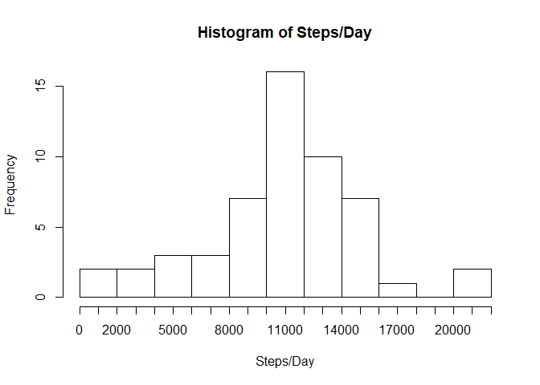
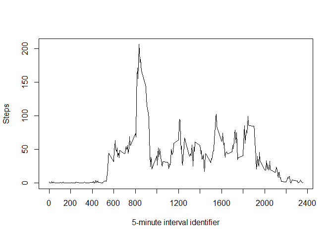
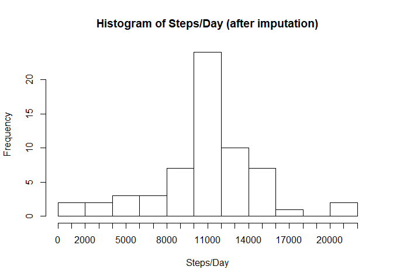
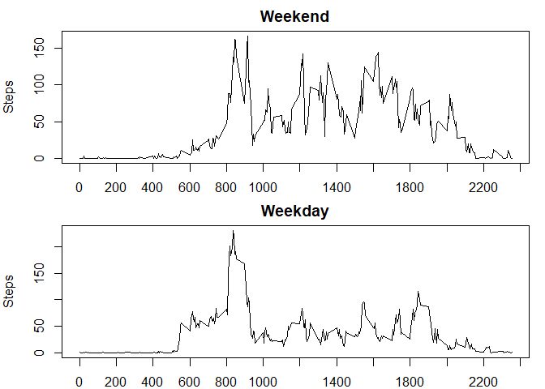

# Reproducible Research: Peer Assessment 1


## Loading and preprocessing the data

```r
unzip("activity.zip")
d <- read.csv("activity.csv")
```

## What is mean total number of steps taken per day?

1. Calculate the total number of steps taken per day

```r
dayTotals <- aggregate(d$steps, by=list(date=d$date), FUN=sum)
```

2. Make a histogram of the total number of steps taken each day

```r
hist(dayTotals$x, breaks=10, main="Histogram of Steps/Day", xaxt="n", xlab = "Steps/Day")
axis(side=1, at=seq(0,22000, 1000), labels=seq(0,22000,1000))
```

<!-- -->
  
3. Calculate and report the mean and median of the total number of steps taken per day

```r
dailyMean <- mean(dayTotals$x, na.rm = TRUE)
dailyMedian <- median(dayTotals$x, na.rm = TRUE)
```

mean is **10766.19** and median is **10765**

## What is the average daily activity pattern?
1. Make a time series plot of the 5-minute interval (x-axis) and the average number of steps taken, averaged across all days (y-axis)

```r
intervalAverages <- aggregate(d$steps, by=list(interval=d$interval), FUN=mean, na.rm=TRUE, na.action=NULL)
plot(intervalAverages$interval, intervalAverages$x, type="l", xlab="5-minute interval identifier", ylab="Steps", xaxt="n")
axis(side=1, at=seq(0,2400, 200), labels=seq(0,2400,200))
```

<!-- -->
  
2. Which 5-minute interval, on average across all the days in the dataset, contains the maximum number of steps?

```r
maxAverageInterval <- intervalAverages[which.max(intervalAverages$x),1]
```
The 5-minute interval with maximum number of steps is **835**

## Imputing missing values
1. Calculate and report the total number of missing values in the dataset
There are **2304** missing values in the data set.

2. Devise a strategy for filling in all of the missing values in the dataset  
**We will be filling the missing values with the average for that 5-minute interval as we have calculated above.**

3. Create a new dataset that is equal to the original dataset but with the missing data filled in.

```r
d2 <- d
d2$steps[is.na(d2$steps)] <- intervalAverages$x[match(d2$interval[is.na(d2$steps)], intervalAverages$interval)]
```

4. Make a histogram of the total number of steps taken each day and Calculate and report the mean and median total number of steps taken per day  

```r
dayTotals2 <- aggregate(d2$steps, by=list(date=d2$date), FUN=sum)
hist(dayTotals2$x, breaks=10, main="Histogram of Steps/Day (after imputation)", xaxt="n", xlab = "Steps/Day")
axis(side=1, at=seq(0,22000, 1000), labels=seq(0,22000,1000))
```

<!-- -->

```r
dailyMean2 <- mean(dayTotals2$x)
dailyMedian2 <- median(dayTotals2$x)
```
  
After imputing missing values, mean is **10766.19** and median is **10766**  

Since these new values do not differ from previously calculated mean and median, imputing missing values using average 5-minute value did not have any impact on the estimates of the total daily number of steps.


## Are there differences in activity patterns between weekdays and weekends?
1. Create a new factor variable in the dataset with two levels - "weekday" and "weekend" indicating whether a given date is a weekday or weekend day.

```r
d2$day <- weekdays(as.Date(d2$date, format = "%Y-%m-%d"))
d2$day[d2$day=="Saturday" | d2$day=="Sunday"] <- "weekend"
d2$day[d2$day!="weekend"] <- "weekday"
```

2. Make a panel plot containing a time series plot of the 5-minute interval (x-axis) and the average number of steps taken, averaged across all weekday days or weekend days (y-axis).

```r
weekend <- d2[d2$day=="weekend",]
weekendIntervalAverages <- aggregate(weekend$steps, by=list(interval=weekend$interval), FUN=mean)
weekday <- d2[d2$day=="weekday",]
weekdayIntervalAverages <- aggregate(weekday$steps, by=list(interval=weekday$interval), FUN=mean)
par(mfrow=c(2,1),mar=c(2,4,2,1))
plot(weekendIntervalAverages$interval, weekendIntervalAverages$x, type="l", xlab="", ylab="Steps", xaxt="n", main="Weekend")
axis(side=1, at=seq(0,2400, 200), labels=seq(0,2400,200))
plot(weekdayIntervalAverages$interval, weekdayIntervalAverages$x, type="l", xlab="", ylab="Steps", xaxt="n", main="Weekday")
axis(side=1, at=seq(0,2400, 200), labels=seq(0,2400,200))
```

<!-- -->
